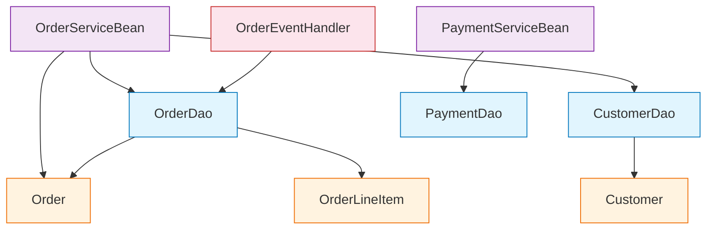

# JAR Scanner MCP Server — Usage Guide

## Overview

A Python MCP server that scans compiled Java JAR files to extract class metadata,
discover DAO-to-Service layer relationships, and generate migration plans —
**without needing source code**.

### Why This Approach?

```
Problem:  Legacy apps have dozens of JARs in WEB-INF/lib.
          Source code may be lost, outdated, or in a different repo.
          You need to understand class dependencies from compiled bytecode.

Solution: Use javap (JDK's bytecode disassembler) + ZIP inspection
          to extract class structure from .class files inside JARs.

          tree-sitter → works on SOURCE code only
          javap        → works on COMPILED bytecode ✅
```

```
┌──────────────────────────────────────────────────────────┐
│              How It Works                                 │
│                                                           │
│  legacy-app.ear / legacy-app.war                         │
│  └── WEB-INF/lib/                                        │
│      ├── legacy-dao-1.0.jar          ◄── scan_jar()      │
│      │   ├── com/company/dao/OrderDao.class              │
│      │   └── com/company/dao/CustomerDao.class           │
│      ├── legacy-service-2.0.jar      ◄── scan_jar()      │
│      │   ├── com/company/service/OrderService.class      │
│      │   └── com/company/service/PaymentService.class    │
│      └── legacy-model-1.0.jar        ◄── scan_jar()      │
│          └── com/company/model/Order.class               │
│                                                           │
│  javap -p -cp legacy-dao-1.0.jar com.company.dao.OrderDao│
│  ↓                                                        │
│  Extracts: superclass, interfaces, annotations,           │
│            fields (injected deps), methods, constants      │
│  ↓                                                        │
│  Classifies: DAO, SERVICE, CONTROLLER, ENTITY, MESSAGING  │
│  ↓                                                        │
│  Maps: OrderService ──uses──► OrderDao (cross-JAR dep)    │
└──────────────────────────────────────────────────────────┘
```

---

## Installation

```bash
# 1. Install FastMCP
pip install fastmcp

# 2. Verify JDK is installed (javap is required)
javap -version
# If not installed: brew install openjdk@21 / apt install openjdk-21-jdk

# 3. Download the server
# Save jar_scanner_mcp_server.py to your preferred location
```

---

## Quick Start

### Option 1: Interactive Testing with FastMCP Dev Mode

```bash
# Launch the MCP inspector (browser-based testing UI)
fastmcp dev jar_scanner_mcp_server.py
```

### Option 2: Register in VS Code (Copilot Agent Mode)

Create `.vscode/mcp.json`:
```json
{
  "servers": {
    "jar-scanner": {
      "command": "python",
      "args": ["/absolute/path/to/jar_scanner_mcp_server.py"]
    }
  }
}
```

### Option 3: Register in Claude Code

```bash
claude mcp add jar-scanner python /absolute/path/to/jar_scanner_mcp_server.py
claude mcp list   # Verify
```

### Option 4: Register in Cursor

Create `.cursor/mcp.json`:
```json
{
  "mcpServers": {
    "jar-scanner": {
      "command": "python",
      "args": ["/absolute/path/to/jar_scanner_mcp_server.py"]
    }
  }
}
```

---

## Available Tools

| Tool | Description |
|------|-------------|
| `scan_jar` | Scan a single JAR file and index all classes |
| `scan_jar_directory` | Scan all JARs in a directory (e.g., WEB-INF/lib) |
| `get_class_info` | Get detailed metadata for a specific class |
| `find_dao_service_relationships` | Discover all DAO→Service dependencies |
| `find_layer_dependencies` | Find deps between any two layers |
| `find_classes_by_layer` | List all classes in a layer (DAO, SERVICE, etc.) |
| `find_ejb_components` | Find and categorize all EJBs |
| `generate_dependency_graph` | Generate Mermaid diagram of dependencies |
| `migration_impact_report` | Impact analysis for migrating a specific class |
| `suggest_migration_order` | Optimal migration wave ordering |
| `reset_registry` | Clear all scanned data |

---

## Real-World Workflow

### Scenario: Legacy EAR with Multiple JARs

Your legacy app is deployed as `order-system.ear` containing:
```
order-system.ear
├── order-web.war
│   └── WEB-INF/lib/
│       ├── order-dao-1.0.jar          (Data access layer)
│       ├── order-service-2.0.jar      (Business logic - EJBs)
│       ├── order-model-1.0.jar        (JPA entities)
│       ├── order-messaging-1.0.jar    (JMS message-driven beans)
│       └── common-utils-3.0.jar       (Shared utilities)
└── order-ejb.jar                      (EJB module)
```

### Step 1: Scan All JARs

**Copilot/Claude prompt:**
```
Scan all JARs in /opt/legacy/order-system/WEB-INF/lib/ with deep scan enabled
```

This calls `scan_jar_directory` → Result:
```json
{
  "jars_scanned": 5,
  "total_classes": 147,
  "jars": [
    {"jar": "order-dao-1.0.jar",       "classes": 23, "layers": {"DAO": 18, "ENTITY": 5}},
    {"jar": "order-service-2.0.jar",   "classes": 35, "layers": {"SERVICE": 30, "CONFIG": 5}},
    {"jar": "order-model-1.0.jar",     "classes": 42, "layers": {"ENTITY": 42}},
    {"jar": "order-messaging-1.0.jar", "classes": 12, "layers": {"MESSAGING": 8, "CONFIG": 4}},
    {"jar": "common-utils-3.0.jar",    "classes": 35, "layers": {"INFRASTRUCTURE": 35}}
  ]
}
```

### Step 2: Discover DAO-Service Relationships

**Prompt:**
```
Find all DAO-to-Service relationships across the scanned JARs
```

This calls `find_dao_service_relationships` → Result:
```json
{
  "total_relationships": 12,
  "cross_jar_relationships": 12,
  "relationships": [
    {
      "source_class": "com.company.service.OrderServiceBean",
      "target_class": "com.company.dao.OrderDao",
      "source_jar": "/opt/legacy/.../order-service-2.0.jar",
      "target_jar": "/opt/legacy/.../order-dao-1.0.jar",
      "relationship": "FIELD_INJECTION"
    },
    {
      "source_class": "com.company.service.OrderServiceBean",
      "target_class": "com.company.dao.CustomerDao",
      "source_jar": "/opt/legacy/.../order-service-2.0.jar",
      "target_jar": "/opt/legacy/.../order-dao-1.0.jar",
      "relationship": "FIELD_INJECTION"
    },
    {
      "source_class": "com.company.service.PaymentServiceBean",
      "target_class": "com.company.dao.PaymentDao",
      "source_jar": "...",
      "target_jar": "...",
      "relationship": "FIELD_INJECTION"
    }
  ]
}
```

### Step 3: Analyze a Specific Class for Migration Impact

**Prompt:**
```
What's the migration impact if I migrate OrderDao first?
```

This calls `migration_impact_report("OrderDao")` → Result:
```json
{
  "class": "com.company.dao.OrderDao",
  "layer": "DAO",
  "is_ejb": false,
  "migration_target": "Spring Data Repository (JpaRepository / MongoRepository)",
  "upstream_dependents": {
    "count": 3,
    "classes": [
      {"class": "com.company.service.OrderServiceBean", "layer": "SERVICE"},
      {"class": "com.company.service.ReportServiceBean", "layer": "SERVICE"},
      {"class": "com.company.messaging.OrderEventHandler", "layer": "MESSAGING"}
    ],
    "note": "These classes MUST be updated when migrating this class."
  },
  "downstream_dependencies": {
    "count": 2,
    "classes": [
      {"class": "com.company.model.Order", "layer": "ENTITY"},
      {"class": "com.company.model.OrderLineItem", "layer": "ENTITY"}
    ],
    "note": "These classes should be migrated BEFORE this class."
  },
  "risk_level": "MEDIUM"
}
```

### Step 4: Get Migration Order

**Prompt:**
```
Suggest the optimal migration order for all scanned classes
```

This calls `suggest_migration_order` → Result:
```json
{
  "total_classes": 147,
  "total_waves": 6,
  "migration_waves": [
    {
      "wave": 1,
      "name": "Entities & Value Objects",
      "classes": ["com.company.model.Order", "com.company.model.Customer", "..."]
    },
    {
      "wave": 2,
      "name": "Data Access Layer (DAOs → Repositories)",
      "classes": ["com.company.dao.OrderDao", "com.company.dao.CustomerDao", "..."]
    },
    {
      "wave": 3,
      "name": "Service Layer (EJBs → @Service)",
      "classes": ["com.company.service.OrderServiceBean", "..."]
    },
    {
      "wave": 4,
      "name": "Messaging (MDB/JMS → @KafkaListener)",
      "classes": ["com.company.messaging.OrderEventHandler", "..."]
    },
    {
      "wave": 5,
      "name": "Controllers (Servlets/Struts → @RestController)",
      "classes": ["com.company.web.OrderServlet", "..."]
    },
    {
      "wave": 6,
      "name": "Infrastructure & Config",
      "classes": ["com.company.util.DateHelper", "..."]
    }
  ]
}
```

### Step 5: Generate Mermaid Dependency Diagram

**Prompt:**
```
Generate a dependency graph diagram for the scanned classes
```

This calls `generate_dependency_graph` → produces a Mermaid diagram you can
render in VS Code, GitHub, or any Markdown viewer:



---

## Deep Scan vs Regular Scan

| Mode | Command | Speed | What It Catches |
|------|---------|-------|-----------------|
| **Regular** | `scan_jar("app.jar")` | Fast | Fields, method signatures, annotations, superclass, interfaces |
| **Deep** | `scan_jar("app.jar", deep_scan=True)` | Slower | All of above + constant pool references (every class referenced in method bodies, casts, exception handlers) |

**Use deep scan when:**
- Services call DAO methods but don't have a DAO field (method-local usage)
- You need to catch transitive dependencies
- Classes use factory patterns or JNDI lookups instead of injection

---

## Layer Classification Logic

The server classifies classes into layers using a priority-based approach:

```
Priority 1: Annotations (most reliable)
  @Entity, @Table, @Document           → ENTITY
  @Repository, @Dao                    → DAO
  @Service, @Stateless, @Stateful      → SERVICE
  @Controller, @RestController, @Path  → CONTROLLER
  @MessageDriven, @JmsListener         → MESSAGING

Priority 2: Interfaces / Superclass
  implements MessageListener           → MESSAGING
  extends HttpServlet                  → CONTROLLER
  extends CrudRepository               → DAO

Priority 3: Package / Naming Convention (fallback)
  .dao., .repository.                  → DAO
  .service.                            → SERVICE
  .controller., .action., .servlet.    → CONTROLLER
  .entity., .model., .domain.          → ENTITY
  .listener., .consumer., .handler.    → MESSAGING
```

---

## Extending the Server

### Add Support for WAR/EAR Files

```python
@mcp.tool()
def scan_war(war_path: str, deep_scan: bool = False) -> dict:
    """Extract and scan all JARs from a WAR file."""
    with tempfile.TemporaryDirectory() as tmpdir:
        with zipfile.ZipFile(war_path, "r") as zf:
            zf.extractall(tmpdir)
        lib_dir = os.path.join(tmpdir, "WEB-INF", "lib")
        if os.path.isdir(lib_dir):
            return scan_jar_directory(lib_dir, deep_scan=deep_scan)
    return {"error": "No WEB-INF/lib found in WAR"}
```

### Add JNDI Lookup Detection

```python
@mcp.tool()
def find_jndi_lookups() -> dict:
    """Find classes using JNDI lookups (need migration to @Autowired)."""
    results = []
    for fqcn, info in registry.class_index.items():
        # Check if any dependency is InitialContext or uses lookup patterns
        if any("InitialContext" in d or "Context" in d for d in info.dependencies):
            results.append({
                "class": fqcn,
                "layer": info.layer,
                "migration_action": "Replace JNDI lookup with @Autowired constructor injection",
            })
    return {"jndi_users": results, "count": len(results)}
```

---

## Troubleshooting

| Issue | Cause | Fix |
|-------|-------|-----|
| `javap not found` | JDK not installed or not on PATH | `export JAVA_HOME=/path/to/jdk && export PATH=$JAVA_HOME/bin:$PATH` |
| `BadZipFile` | Corrupt JAR or not a valid ZIP | Verify JAR integrity: `jar -tf suspect.jar` |
| Classes show as UNKNOWN layer | No matching annotations or naming patterns | Check class with `get_class_info` and add custom patterns |
| Missing cross-JAR deps | Regular scan only catches field types | Use `deep_scan=True` for constant pool analysis |
| Inner classes (`Foo$Bar`) skipped | By design (reduces noise) | Modify `scan_jar` to include `$` classes if needed |

---

*Server Version: 1.0 | Requires: Python 3.10+, FastMCP, JDK 17+*
